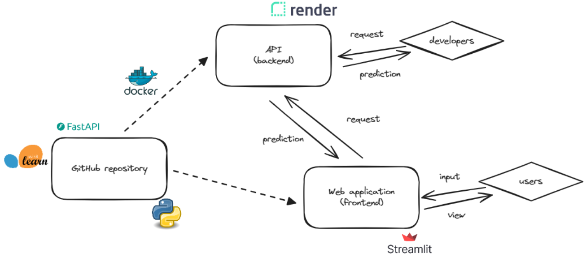
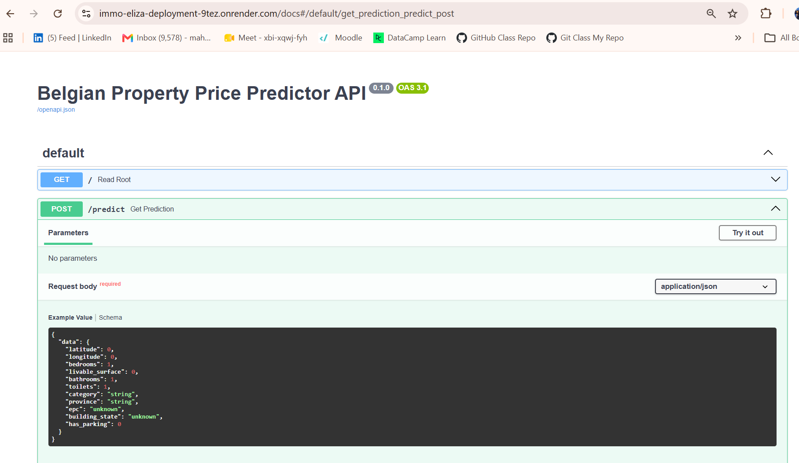
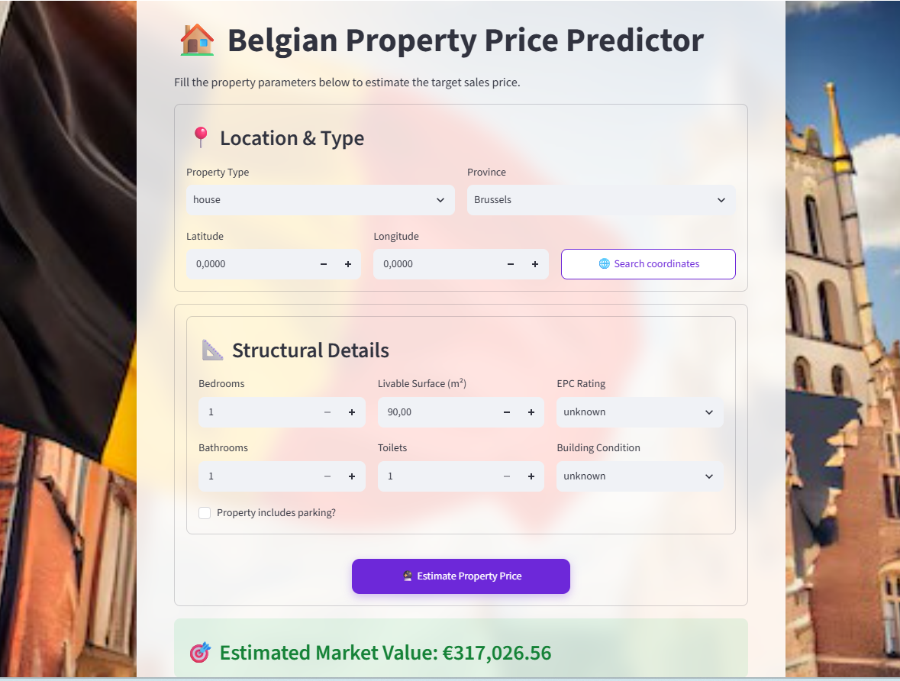

# Belgian Property Price Predictor (Immo Eliza)

A small machine-learning deployment that predicts Belgian residential property sales prices. The project exposes a FastAPI-based prediction API and a Streamlit web interface for non-technical users to estimate market values.


## Table of contents

- About
- Features
- Stack & dependencies
- Project structure (typical)
- Quick start (local)
- Model artifact
- Running the API
- API: endpoints & schema
- Example requests (curl & Python)
- Running the Streamlit app
- Deployment notes (Render & Streamlit Community Cloud
- Author

---


## About

This project loads a trained model to estimate Belgian property prices and offers:



- A programmatic REST endpoint for predictions (FastAPI), and
- A user-friendly Streamlit front-end for entering property features and displaying estimates.
- The Streamlit UI collects user inputs and either (a) calls the running prediction API (POST /predict) or (b) loads the model directly and predicts locally.
- The FastAPI application loads the serialized model at startup and exposes endpoints (POST /predict) that accept validated JSON payloads (via Pydantic) and return predicted prices.

**Live deployments**

- Render (API + interactive docs): https://immo-eliza-deployment-9tez.onrender.com/docs
- Streamlit (UI): https://immo-eliza-deployment-becode-project.streamlit.app/

<u>Screenshots:</u>

- API documentation (Swagger / OpenAPI UI) showing the POST /predict request body example and schema.

  
- Streamlit web app UI showing the input form (Location & Type, Structural Details) and the estimated market value banner.
- 

## Features

- POST /predict endpoint that accepts JSON payloads describing the property and returns a predicted price
- Interactive API documentation (OpenAPI / Swagger) for testing and exploring endpoints (see Image 1)
- Streamlit interface with organized input sections and a prominent estimated market value display (see Image 2)
- Basic input validation and a simple UX for exploring typical property features (location, surface, rooms, EPC, condition, parking, etc.)

## Stack

- Language: Python
- Frameworks: FastAPI (API), Streamlit (UI)
- Notable libraries: scikit-learn, xgboost, pandas, joblib, pydantic, geopy

## Requirements

See `requirements.txt` (example dependencies observed in repository):

- fastapi==0.115.12
- uvicorn==0.34.2
- pydantic
- pandas
- joblib
- scikit-learn
- xgboost
- numpy
- streamlit==1.59.1
- requests
- geopy

---

## Project structure

(Adjust actual filenames/paths to match this repo)

- `README.md` — this file
- `requirements.txt` — Python dependencies
- `main.py` (or `api.py`) — FastAPI app (ASGI app instance)
- `models/` — trained model artifacts (e.g., `model.joblib`)
- `streamlit_app.py` (or `app.py`) — Streamlit UI entrypoint
- `utils/` or `src/` — helpers for preprocessing, feature engineering, geocoding
- `tests/` — optional tests

---

## Quick start (local)

1. Clone the repo:

```bash
git clone https://github.com/mahalakshmip1604/immo-eliza-deployment.git
cd immo-eliza-deployment
```

2. Create a virtual environment and install dependencies:

```bash
python -m venv .venv
# macOS / Linux
source .venv/bin/activate
# Windows (PowerShell)
.\.venv\Scripts\Activate.ps1

pip install -r requirements.txt
```

3. Ensure a trained model artifact exists (see "Model artifact" below).

---

## Model artifact

- The API and Streamlit app expect a trained model artifact (`models/immo_property_sale_XGBoost_model.joblib`). If no artifact is present in the repository, add a serialized model file at the path referenced by the code, or update the code to point to your model location.
- Recommended serialization: `joblib.dump()` for scikit-learn / xgboost models.

---

## How to run the API (local)

Typical command (adjust `module:app` to the actual module and app variable used in the repo):

```bash
uvicorn api.api:app --reload --host 0.0.0.0 --port 8000
```

Once running, open interactive docs:

```
http://127.0.0.1:8000/docs
```

Notes:

- When deploying to platforms like Render, ensure the service listens on the `PORT` environment variable provided by the platform.

---

## API endpoints & request schema

- GET / — root / health check (may return simple status)
- POST /predict — get prediction

Expected request body (example — matches schema shown in Swagger screenshot):

```json
{
  "data": {
    "latitude": 50.87,
    "longitude": 4.4082,
    "bedrooms": 1,
    "livable_surface": 90,
    "bathrooms": 1,
    "toilets": 1,
    "category": "house",
    "province": "Brussels",
    "epc": "unknown",
    "building_state": "unknown",
    "has_parking": 0
  }
}
```

Response

- The API typically returns a JSON object containing the predicted price (float) . The Streamlit UI displays the predicted market value in a user-friendly banner.

---

## Example curl call

```bash
curl -X POST "http://127.0.0.1:8000/predict" \
  -H "Content-Type: application/json" \
  -d '{
    "data": {
      "latitude": 50.87,
      "longitude": 4.4082,
      "bedrooms": 1,
      "livable_surface": 90,
      "bathrooms": 1,
      "toilets": 1,
      "category": "house",
      "province": "Brussels",
      "epc": "unknown",
      "building_state": "unknown",
      "has_parking": 0
    }
  }'
```

Python requests example:

```python
import requests

url = "http://127.0.0.1:8000/predict"
data = {
  "data": {
    "latitude": 50.87,
    "longitude": 4.4082,
    "bedrooms": 1,
    "livable_surface": 90,
    "bathrooms": 1,
    "toilets": 1,
    "category": "house",
    "province": "Brussels",
    "epc": "unknown",
    "building_state": "unknown",
    "has_parking": 0
  }
}
resp = requests.post(url, json=data)
print(resp.status_code, resp.json())
```

---

## How to run the Streamlit UI (local)

Start the Streamlit app (adjust filename if different):

```bash
streamlit run streamlit/app_frontend.py
```

UI layout :

- Location & Type: property type, province, latitude, longitude (there may be a "Search coordinates" helper)
- Structural Details: bedrooms, livable surface (m²), EPC rating, building condition, bathrooms, toilets, parking checkbox
- Submit button: "Estimate Property Price" — the app displays a result banner: "Estimated Market Value: €xxx,xxx.xx"

If the Streamlit app calls the API instead of loading the model locally, configure the API base URL (for example via an environment variable `API_BASE_URL`).

---

## Deployment notes

Render (API + docs)

- URL: https://immo-eliza-deployment-9tez.onrender.com/docs
- Tips:
  - Use an ASGI server (uvicorn) for production or a process manager as recommended by Render.
  - Ensure the model artifact is included in the deployment or load it from a persistent storage location reachable at runtime.
  - Make the server listen on the `PORT` environment variable when required.

Streamlit Community Cloud (share.streamlit.io)

- URL: https://immo-eliza-deployment-becode-project.streamlit.app/
- Tips:
  - If Streamlit calls the remote API, set the API URL to the Render endpoint.
  - Use Streamlit secrets manager for any credentials or secret configuration.
  - Confirm CORS settings on the API to permit calls from the Streamlit host if needed.

---

## Author

- GitHub: [@mahalakshmip1604](https://github.com/mahalakshmip1604)
- LinkedIn: [www.linkedin.com/in/mahalakshmi-palanivel-4b6701296](https://www.linkedin.com/in/mahalakshmi-palanivel-4b6701296)

---

**Last Updated**: July 2026
**Project**: BeCode Training Solo Project
**Status**: Production Ready ✓
